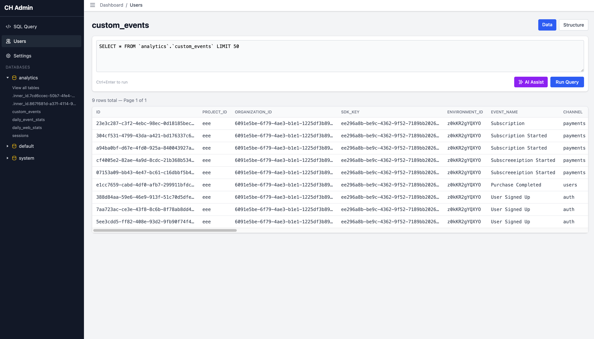
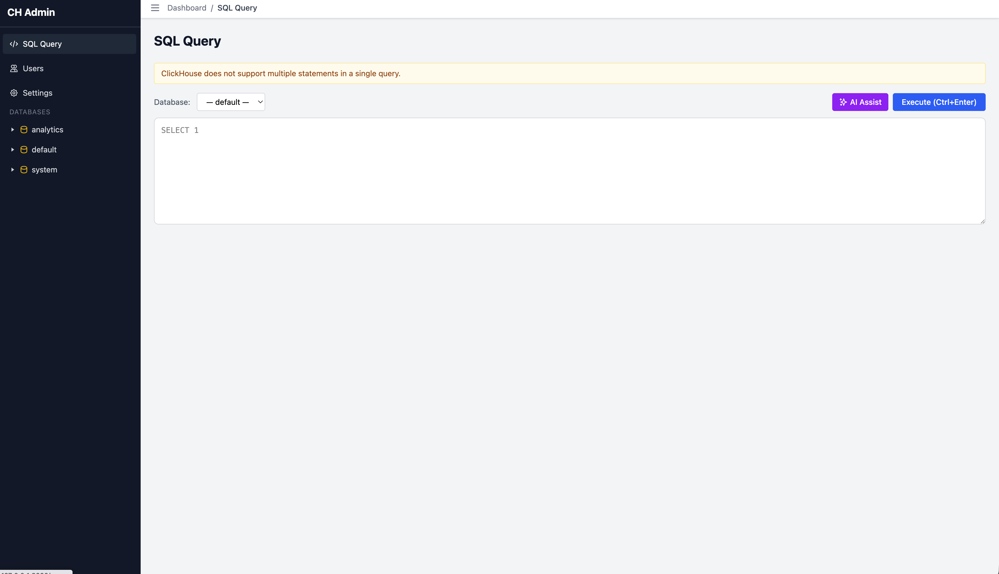

# ClickHouse Admin

A fast, lightweight web UI for managing ClickHouse databases. Browse databases, inspect table structures, edit data inline, run SQL queries with autocomplete, and manage users — all from a single Docker container.

Built with Laravel, HTMX, and Tailwind CSS. No JavaScript frameworks. No build complexity. Just a fast admin panel that gets out of your way.





## Features

- **Server Dashboard** — Version, uptime, storage usage, and database overview at a glance
- **Database Browser** — Navigate databases and tables with row counts, engines, and sizes
- **Table Structure** — View columns, types, primary/sorting/partition keys, defaults, and the full `CREATE TABLE` statement
- **Table Data** — Paginated data browser with column sorting, inline cell editing, and a JSON viewer/editor for complex fields
- **SQL Editor** — Full query editor powered by CodeMirror with syntax highlighting, schema-aware autocomplete, and keyboard shortcuts (Ctrl+Enter to execute)
- **User Management** — List users, create new ones, view permissions, grant/revoke access, and delete users
- **HTMX-Powered** — Snappy partial page updates without full reloads
- **Basic Auth** — Optional HTTP basic authentication to protect access
- **Single Container** — Ships as one Docker image with PHP-FPM, Nginx, and Supervisor — nothing else to configure

> **Security:** This tool gives full SQL access to your ClickHouse server. Always enable basic auth (`APP_AUTH_ENABLED=true`) and use a strong password, especially if the instance is exposed to the internet. For production, put it behind a reverse proxy with HTTPS.

## Quick Start with Docker Compose

The fastest way to get running. This connects to an existing ClickHouse server on your host machine.

**1. Create a `docker-compose.yml`:**

```yaml
services:
  clickhouse-admin:
    image: ghcr.io/your-username/clickhouse-admin:latest
    ports:
      - "8080:80"
    environment:
      - CLICKHOUSE_HOST=host.docker.internal  # your ClickHouse server
      - CLICKHOUSE_PORT=8123
      - CLICKHOUSE_USER=default
      - CLICKHOUSE_PASSWORD=your-password
      - APP_AUTH_ENABLED=true
      - APP_AUTH_USERNAME=admin
      - APP_AUTH_PASSWORD=changeme
```

**2. Start it:**

```bash
docker compose up -d
```

**3. Open** [http://localhost:8080](http://localhost:8080)

## Build from Source

If you'd rather build the Docker image yourself:

```bash
git clone https://github.com/your-username/clickhouse-admin.git
cd clickhouse-admin
docker build -t clickhouse-admin .
```

Then run it:

```bash
docker run -d \
  -p 8080:80 \
  -e CLICKHOUSE_HOST=host.docker.internal \
  -e CLICKHOUSE_PORT=8123 \
  -e CLICKHOUSE_USER=default \
  -e CLICKHOUSE_PASSWORD=your-password \
  -e APP_AUTH_ENABLED=true \
  -e APP_AUTH_USERNAME=admin \
  -e APP_AUTH_PASSWORD=changeme \
  clickhouse-admin
```

## Environment Variables

| Variable | Default | Description |
|---|---|---|
| `CLICKHOUSE_HOST` | `localhost` | ClickHouse server hostname |
| `CLICKHOUSE_PORT` | `8123` | ClickHouse HTTP port |
| `CLICKHOUSE_PROTOCOL` | `http` | Protocol (`http` or `https`) |
| `CLICKHOUSE_USER` | `default` | ClickHouse username |
| `CLICKHOUSE_PASSWORD` | _(empty)_ | ClickHouse password |
| `CLICKHOUSE_DATABASE` | `default` | Default database |
| `CLICKHOUSE_TIMEOUT` | `30` | Query timeout in seconds |
| `APP_AUTH_ENABLED` | `false` | Enable HTTP basic auth |
| `APP_AUTH_USERNAME` | `admin` | Basic auth username |
| `APP_AUTH_PASSWORD` | `admin` | Basic auth password |
| `APP_PORT` | `8080` | Host port (Docker Compose only) |

## Deploy to Your Server

### Option 1: Docker Compose (Recommended)

**1.** SSH into your server and create a project directory:

```bash
mkdir -p /opt/clickhouse-admin && cd /opt/clickhouse-admin
```

**2.** Create a `docker-compose.yml`:

```yaml
services:
  clickhouse-admin:
    image: ghcr.io/your-username/clickhouse-admin:latest
    ports:
      - "127.0.0.1:8080:80"  # bind to localhost only
    environment:
      - CLICKHOUSE_HOST=your-clickhouse-host
      - CLICKHOUSE_PORT=8123
      - CLICKHOUSE_USER=default
      - CLICKHOUSE_PASSWORD=your-password
      - APP_AUTH_ENABLED=true
      - APP_AUTH_USERNAME=admin
      - APP_AUTH_PASSWORD=a-strong-password
    restart: unless-stopped
```

**3.** Start it:

```bash
docker compose up -d
```

**4.** Set up a reverse proxy (Nginx/Caddy) to serve it over HTTPS:

```nginx
# /etc/nginx/sites-available/clickhouse-admin
server {
    listen 443 ssl;
    server_name ch-admin.yourdomain.com;

    ssl_certificate     /etc/letsencrypt/live/ch-admin.yourdomain.com/fullchain.pem;
    ssl_certificate_key /etc/letsencrypt/live/ch-admin.yourdomain.com/privkey.pem;

    location / {
        proxy_pass http://127.0.0.1:8080;
        proxy_set_header Host $host;
        proxy_set_header X-Real-IP $remote_addr;
        proxy_set_header X-Forwarded-For $proxy_add_x_forwarded_for;
        proxy_set_header X-Forwarded-Proto $scheme;
    }
}
```

Or with Caddy (auto HTTPS):

```
ch-admin.yourdomain.com {
    reverse_proxy 127.0.0.1:8080
}
```

### Option 2: Build on the Server

If you prefer to build locally or don't want to use a registry:

```bash
git clone https://github.com/your-username/clickhouse-admin.git /opt/clickhouse-admin
cd /opt/clickhouse-admin
docker build -t clickhouse-admin .
docker compose up -d
```

## Local Development

**Prerequisites:** PHP 8.2+, Composer, Node.js 18+

```bash
git clone https://github.com/your-username/clickhouse-admin.git
cd clickhouse-admin

# Install dependencies
composer install
npm install

# Configure environment
cp .env.example .env
php artisan key:generate

# Edit .env with your ClickHouse connection details
# Then start the dev server:
composer dev
```

This starts the Laravel dev server, Vite HMR, queue worker, and log watcher concurrently.

## Tech Stack

- **[Laravel 12](https://laravel.com)** — PHP backend
- **[HTMX](https://htmx.org)** — Partial page updates without a JS framework
- **[Tailwind CSS 4](https://tailwindcss.com)** — Utility-first styling
- **[CodeMirror 6](https://codemirror.net)** — SQL editor with syntax highlighting and autocomplete
- **[Alpine.js-free]** — Zero frontend framework overhead

## Contributing

Contributions are welcome. Please open an issue first to discuss what you'd like to change.

## License

[MIT](LICENSE)
